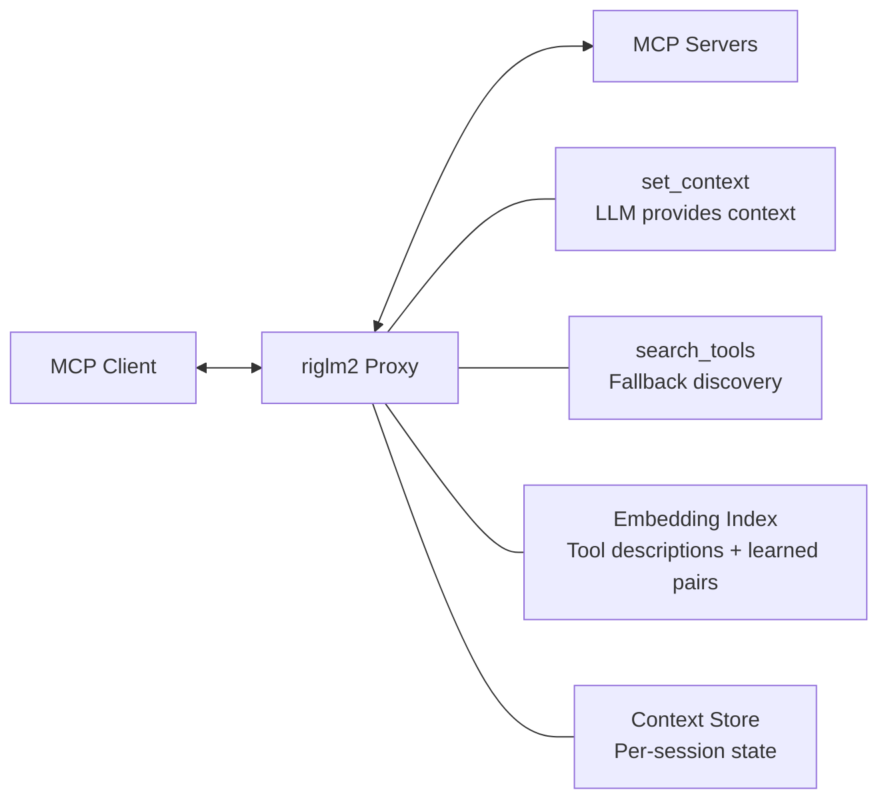

# riglm2

Adaptive tool selection for MCP. A transparent proxy that learns tool relevance from usage patterns.

## Quick Context

- **Problem**: MCP clients face context bloat when aggregating many tools. LLM performance degrades past ~20 tools.
- **Solution**: RAG-based tool filtering—embed queries, find similar contexts, surface relevant tools.
- **Core Challenge**: MCP servers are blind to conversation context (only see `tools/call`, not user queries).

## Key Documents

| Document | Purpose |
|----------|---------|
| [design-log/index.md](design-log/index.md) | **Start here each session**. Index of all design logs. |
| [references/mission.md](references/mission.md) | Solution approach and core mechanisms |
| [references/product-seed.md](references/product-seed.md) | Vision and feature roadmap |
| [references/solution1-design.md](references/solution1-design.md) | Hexagonal architecture for Tool Context Optimizer |

## Design Logs

Design logs live in `./design-log/` with an index. Each log follows the structure:

**Background → Problem → Questions and Answers → Design → Implementation Plan → Trade-offs → Verification Criteria**

| # | Title | Focus |
|---|-------|-------|
| 01 | Architecture Overview | Core problem, high-level design |
| 02 | Platform Evaluation | MCProxy vs MetaMCP vs Magg |
| 03 | Context Injection | `set_context` pattern |
| 04 | Embedding Strategy | What to embed, model choices |
| 05 | Learning Loop | Observing usage, updating index |
| 06 | Cold Start & Recovery | Escape valves, thresholds |

## Reference Knowledge Bases

Generated documentation for upstream projects:

| Directory | Project | Key Files |
|-----------|---------|-----------|
| `references/metamcp/` | MetaMCP aggregator | `01-overview.md`, `08-extension-points.md` |
| `references/magg/` | Magg hot-reload aggregator | `01-overview.md`, `04-hot-reload.md` |
| `references/mcproxy/` | igrigorik/MCProxy | `01-overview.md`, `04-middleware-system.md` |

## Current Architecture Direction

Proxy-based semantic filtering with meta-tools for context injection:

## Tech Stack (Planned)

- TypeScript / Bun
- MCP SDK for protocol handling
- Vector store for embeddings (TBD: local vs API)
- SQLite/PostgreSQL for analytics

## Commands

No build commands yet. Project is in design phase.
