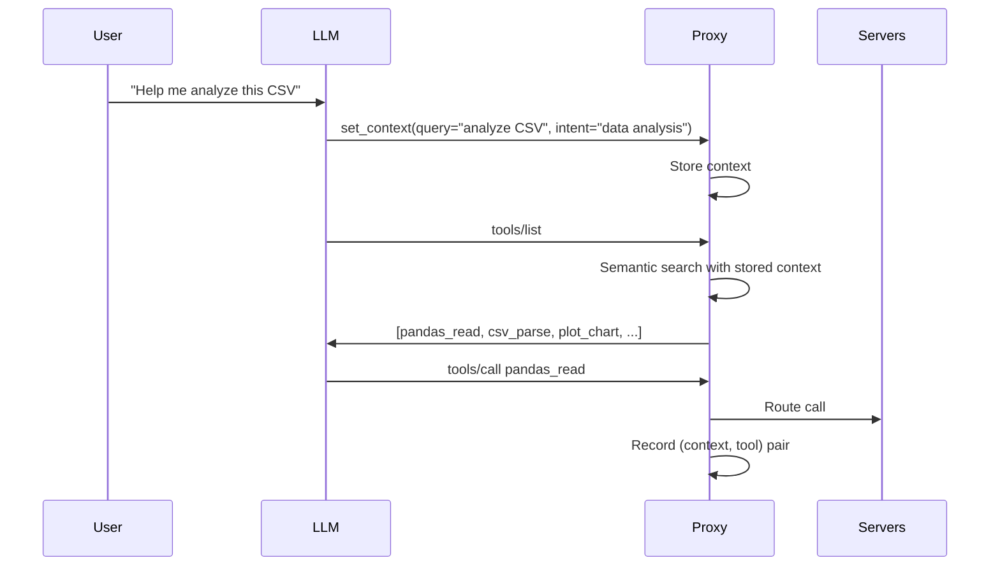

# 03: Context Injection

## Background

MCP servers are **context blind**—they only see `tools/call` with arguments, never the user query. This is the fundamental challenge for intelligent tool selection.

---

## Problem

How does the proxy know what the user is trying to do if MCP doesn't pass query context?

---

## Questions and Answers

### Can we extract context from MCP protocol?
**No**. The protocol doesn't include user queries. Servers only see:
- `tools/list` — no context
- `tools/call` — tool name + arguments only

### What about protocol extensions?
**SEP-1576** (Huawei proposal) would add native support:
- LLM generates intent
- Server returns top-k tools by embedding similarity

If adopted, riglm2's architecture could become reference implementation. Worth tracking.

### Pragmatic solution within current spec?
**The `set_context` tool pattern**:
```
User query → LLM calls set_context(query, intent) → Proxy stores context
           → tools/list returns filtered tools based on stored context
```

✅ Works with standard clients
✅ No protocol fork needed
✅ LLM naturally summarizes user intent

---

## Design

### `set_context` Tool Schema

```typescript
{
  name: "set_context",
  description: "Tell the proxy what you're trying to accomplish so it can surface relevant tools",
  inputSchema: {
    type: "object",
    properties: {
      query: {
        type: "string",
        description: "The user's request or question"
      },
      intent: {
        type: "string",
        description: "What you're trying to accomplish (e.g., 'file manipulation', 'data analysis')"
      }
    },
    required: ["query"]
  }
}
```

### Context Store

Per-session state:
```typescript
interface SessionContext {
  sessionId: string;
  currentQuery?: string;
  currentIntent?: string;
  toolsUsedThisSession: string[];
  lastUpdated: Date;
}
```

### Flow



---

## Trade-offs

### Relies on LLM Cooperation
- LLM must call `set_context` for filtering to work
- If LLM skips it, proxy falls back to showing all tools (or top-k by description similarity)

### Intent Quality
- LLM's intent summary may not perfectly capture user need
- Mitigation: Learn from actual tool usage, not just stated intent

---

## Verification Criteria

1. LLM calls `set_context` in >90% of sessions
2. Stored context correlates with tools actually used
3. Filtering quality improves vs no context
