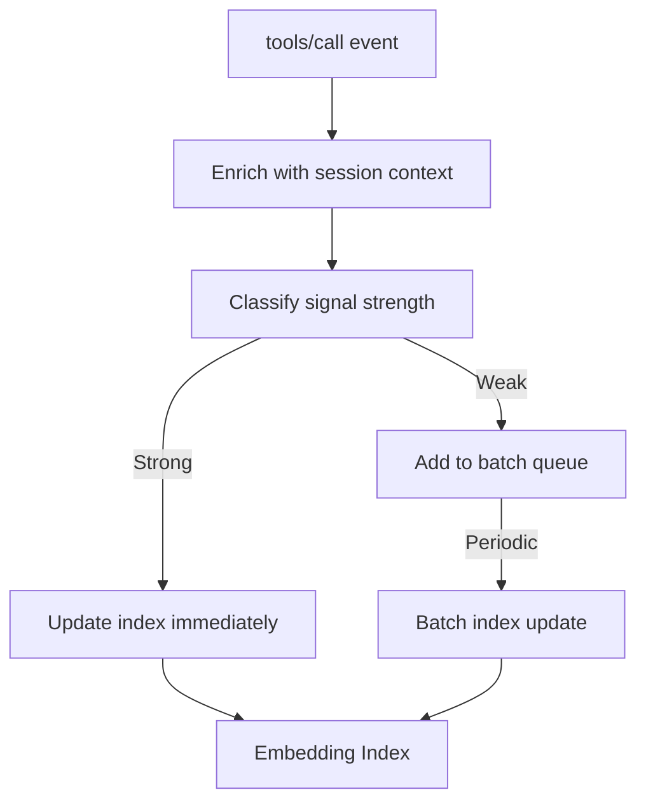

# 05: Learning Loop

## Background

riglm2's differentiator is learning from usage. The proxy observes which tools are actually called and updates its relevance model.

---

## Problem

How to:
1. Observe tool usage without impacting performance
2. Extract meaningful learning signals
3. Update the index efficiently

---

## Questions and Answers

### What events to observe?

| Event | Data Captured | Use |
|-------|---------------|-----|
| `tools/list` with context | Query, intent | Retrieval input |
| `tools/call` | Tool name, arguments | Actual usage |
| `search_available_tools` | Search query, result | Discovery patterns |

### How to correlate context with tool calls?

Session-based correlation:
1. `set_context` stores query in session
2. Subsequent `tools/call` events are attributed to that context
3. New `set_context` starts fresh correlation window

```typescript
interface UsageEvent {
  sessionId: string;
  context: {
    query: string;
    intent?: string;
  };
  toolsCalled: {
    name: string;
    timestamp: Date;
    wasRetrieved: boolean;  // Was this in the filtered list?
    wasSearched: boolean;   // Was this found via search_available_tools?
  }[];
}
```

### When to update the index?

Options:
1. **Real-time**: Update on each `tools/call` — freshest but most I/O
2. **Batched**: Accumulate events, update periodically — less I/O but stale
3. **Hybrid**: Real-time for high-confidence signals, batched for weak signals

**Recommendation**: Hybrid approach. Strong positive signals (tool retrieved AND used) update immediately. Weak signals batch.

---

## Design

### Learning Pipeline



### Signal Classification

```typescript
function classifySignal(event: UsageEvent): SignalStrength {
  const tool = event.toolsCalled[0];

  if (tool.wasSearched && tool.wasRetrieved) {
    // User searched, we found it, they used it
    return SignalStrength.VERY_STRONG;
  }

  if (tool.wasRetrieved) {
    // We suggested it, they used it
    return SignalStrength.STRONG;
  }

  if (tool.wasSearched) {
    // They had to search for it (we missed it)
    return SignalStrength.DISCOVERY;
  }

  // Tool was used but wasn't in our suggestions
  return SignalStrength.WEAK;
}
```

### Index Update

For strong/very strong signals:
```typescript
async function recordLearnedPair(
  query: string,
  toolName: string,
  confidence: number
) {
  const queryVector = await embed(query);
  await index.upsert({
    id: `learned:${hash(query)}:${toolName}`,
    vector: queryVector,
    metadata: {
      type: 'learned_pair',
      toolName,
      confidence,
      query,  // For debugging
    }
  });
}
```

---

## Trade-offs

### Privacy
- Storing queries could be sensitive
- Mitigation: Hash queries, store only embeddings, or offer opt-out

### Index Growth
- Every unique query+tool pair adds to index
- Mitigation: Dedupe similar queries, prune low-confidence pairs

### Feedback Loop Risks
- If retrieval is bad, usage is limited, learning is slow
- Mitigation: `search_available_tools` as escape valve (see Design Log #06)

---

## Verification Criteria

1. Learning pipeline latency <10ms for strong signals
2. Index updates are durable (no lost signals on restart)
3. Retrieval quality improves measurably over 100+ sessions
