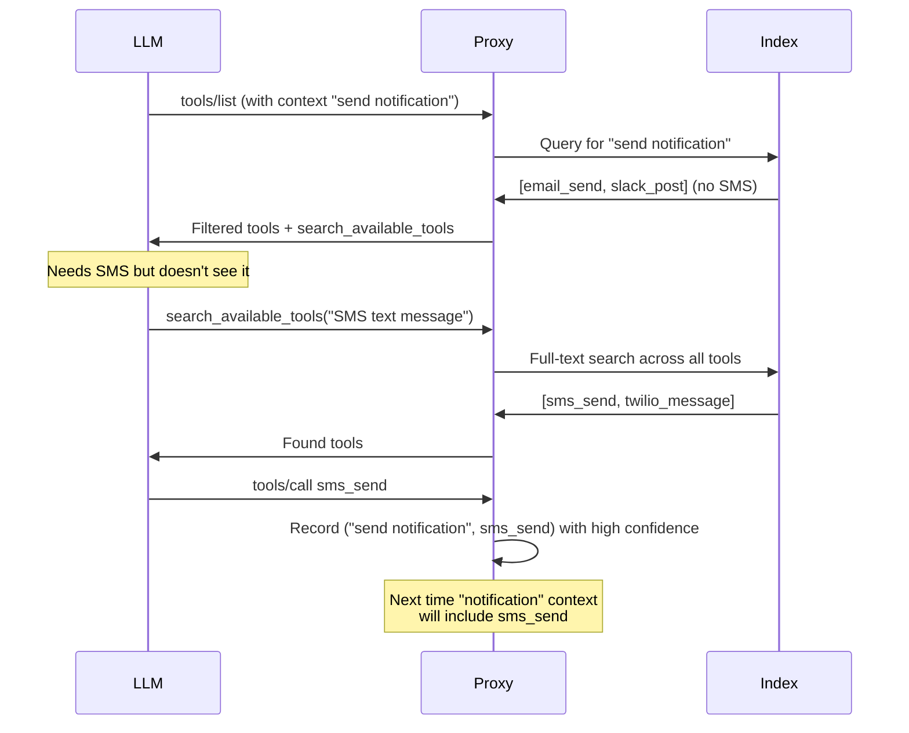

# 06: Cold Start & Recovery

## Background

A learning system faces the cold start paradox: tools never surfaced → never used → never generate signal → never surfaced.

---

## Problem

1. How to handle new tools with no usage history?
2. How to recover when retrieval misses the right tool?
3. When to transition from "show all" to "filter"?

---

## Questions and Answers

### The Cold Start Paradox

```
New tool added
    → No usage history
    → Low confidence in retrieval
    → Not surfaced to LLM
    → Never used
    → Still no history
    → ∞ loop
```

### Solution: `search_available_tools` Escape Valve

Always inject a meta-tool that lets the LLM discover tools the retrieval missed:

```typescript
{
  name: "search_available_tools",
  description: "Search for tools when you need functionality not in your current tool list",
  inputSchema: {
    type: "object",
    properties: {
      query: {
        type: "string",
        description: "What capability are you looking for?"
      }
    },
    required: ["query"]
  }
}
```

**Why this works**:
- LLM can always find tools it needs
- Search query + resulting tool call = very strong positive signal
- Breaks the cold start loop

### Confidence Thresholds

**Q**: What confidence level triggers transition from "show all" to "filter"?

**A**: Per-context, not per-tool. Key insight:
- A tool might be highly relevant for "data analysis" but irrelevant for "email"
- Confidence should be context-specific

Proposed thresholds:
| Context Confidence | Behavior |
|--------------------|----------|
| < 0.3 | Show all tools (cold start mode) |
| 0.3 - 0.7 | Filter with `search_available_tools` prominent |
| > 0.7 | Filter, `search_available_tools` available but not prominent |

**How to calculate context confidence**:
```typescript
function contextConfidence(context: string): number {
  const similarContexts = index.query(embed(context), k=10);
  const avgSimilarity = mean(similarContexts.map(c => c.score));
  const usageCount = similarContexts.filter(c => c.metadata.used).length;

  return avgSimilarity * (usageCount / 10);
}
```

### Multi-turn Tool Persistence

**Q**: How to handle tools across conversation turns?

**A**: Still underspecified. Options considered:

| Strategy | Pros | Cons |
|----------|------|------|
| Replace per turn | Fresh context each turn | Claude loses tools it used |
| Accumulate | Continuity | Back to context bloat |
| Expire after N turns | Balance | Arbitrary cutoff |
| Usage-based retention | Smart | Complex to implement |

**Current recommendation**: Usage-based retention
- Tools used in last 3 turns stay in list
- Tools not used decay in priority
- New context re-ranks all tools

---

## Design

### Recovery Flow



### Cold Start Detection

```typescript
function isColdStart(sessionId: string): boolean {
  const session = getSession(sessionId);

  // No context set yet
  if (!session.currentQuery) return true;

  // Very low confidence for this context
  const confidence = contextConfidence(session.currentQuery);
  if (confidence < 0.3) return true;

  return false;
}
```

### Graceful Degradation

```typescript
function getToolsForSession(sessionId: string): Tool[] {
  if (isColdStart(sessionId)) {
    // Show all tools, but add search meta-tool prominently
    return [searchAvailableTools, ...allTools.slice(0, 50)];
  }

  const context = getSession(sessionId).currentQuery;
  const filtered = retrieveTools(context, k=15);

  // Always include search as escape valve
  return [searchAvailableTools, ...filtered];
}
```

---

## Trade-offs

### Show All vs Filter
- Showing all defeats the purpose (context bloat)
- Filtering too aggressively misses tools
- Confidence thresholds need tuning per deployment

### Search as Crutch
- If LLM relies on search too much, retrieval isn't working
- Monitor search frequency as quality metric

---

## Verification Criteria

1. Cold start detection is accurate (no false positives in mature sessions)
2. `search_available_tools` usage decreases over time as learning improves
3. Tools discovered via search appear in future retrievals for similar contexts
4. Multi-turn sessions maintain access to needed tools without bloat
