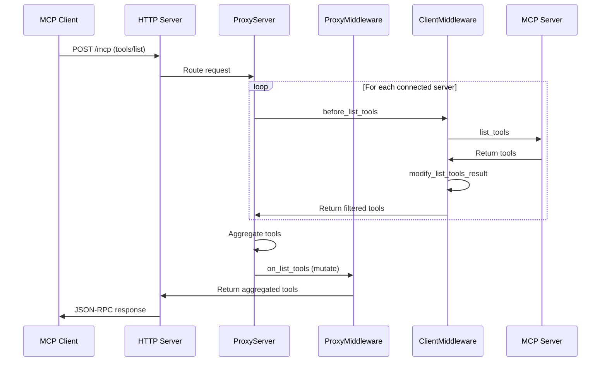

# MCProxy Architecture

[← Back to Index](index.md)

---

## High-Level Diagram

```
┌─────────────────────────────────────────────────────────────────────┐
│                         MCP Clients                                  │
│              (Claude Desktop, Cursor, Custom Agents)                 │
└─────────────────────────────────────────────────────────────────────┘
                                    │
                                    ▼
                         ┌───────────────────┐
                         │  HTTP/JSON-RPC    │
                         │  Server (Axum)    │
                         │  POST /mcp        │
                         │  GET /health      │
                         └───────────────────┘
                                    │
                                    ▼
┌─────────────────────────────────────────────────────────────────────┐
│                         ProxyServer                                  │
│  ┌───────────────────────────────────────────────────────────────┐  │
│  │                    ProxyMiddleware Layer                       │  │
│  │  ┌──────────────────┐  ┌────────────────────┐                 │  │
│  │  │ Description      │  │   Tool Search      │                 │  │
│  │  │ Enricher         │  │   (Tantivy)        │                 │  │
│  │  └──────────────────┘  └────────────────────┘                 │  │
│  └───────────────────────────────────────────────────────────────┘  │
│                                    │                                 │
│  ┌───────────────────────────────────────────────────────────────┐  │
│  │              Connected Servers (HashMap)                       │  │
│  │  ┌─────────────────────────────────────────────────────────┐  │  │
│  │  │  Server A                    Server B                    │  │  │
│  │  │  ┌───────────────────┐       ┌───────────────────┐      │  │  │
│  │  │  │ ClientMiddleware  │       │ ClientMiddleware  │      │  │  │
│  │  │  │  - Logging        │       │  - Logging        │      │  │  │
│  │  │  │  - ToolFilter     │       │  - Security       │      │  │  │
│  │  │  └───────────────────┘       └───────────────────┘      │  │  │
│  │  │          │                           │                   │  │  │
│  │  │          ▼                           ▼                   │  │  │
│  │  │  ┌───────────────────┐       ┌───────────────────┐      │  │  │
│  │  │  │ MCP Client        │       │ MCP Client        │      │  │  │
│  │  │  │ (STDIO)           │       │ (HTTP)            │      │  │  │
│  │  │  └───────────────────┘       └───────────────────┘      │  │  │
│  │  └─────────────────────────────────────────────────────────┘  │  │
│  └───────────────────────────────────────────────────────────────┘  │
└─────────────────────────────────────────────────────────────────────┘
                    │                           │
                    ▼                           ▼
            ┌──────────────┐           ┌──────────────┐
            │ STDIO Server │           │ HTTP Server  │
            │ (subprocess) │           │ (remote)     │
            └──────────────┘           └──────────────┘
```

---

## Tech Stack

| Layer | Technology |
|-------|------------|
| **Runtime** | Rust 2021 edition |
| **Async** | Tokio with full features |
| **HTTP Server** | Axum 0.8 |
| **HTTP Middleware** | Tower / Tower-HTTP |
| **MCP SDK** | rmcp 0.2.1 |
| **Search Engine** | Tantivy 0.22 |
| **Serialization** | Serde / Serde JSON |
| **Logging** | Tracing / Tracing Subscriber |
| **Error Handling** | thiserror 1.0 |

---

## Directory Structure

```
/data/Workspace/MCProxy/
├── Cargo.toml              # Rust dependencies
├── Cargo.lock              # Dependency lock
├── README.md               # Project overview
├── CLAUDE.md               # Development guidance
├── example-config.json     # Configuration example
├── docs/
│   ├── MIDDLEWARE.md       # Middleware architecture
│   ├── SEARCH.md           # Tool search docs
│   └── NOTIFICATIONS.md    # SSE notifications
└── src/
    ├── main.rs             # Entry point, CLI, tests
    ├── config.rs           # JSON config parsing
    ├── error.rs            # ProxyError type
    ├── http_server.rs      # Axum HTTP server
    ├── proxy.rs            # Core aggregation logic
    └── middleware/
        ├── mod.rs          # MiddlewareManager
        ├── client.rs       # ClientMiddleware trait
        ├── proxy.rs        # ProxyMiddleware trait
        ├── registry.rs     # Factory registry
        ├── client_middleware/
        │   ├── mod.rs
        │   ├── logging.rs
        │   ├── tool_filter.rs
        │   └── security.rs
        └── proxy_middleware/
            ├── mod.rs
            ├── description_enricher.rs
            └── tool_search.rs
```

---

## Service Ports

| Port | Service | Description |
|------|---------|-------------|
| 8080 (default) | HTTP Server | JSON-RPC 2.0 endpoint |

---

## HTTP Endpoints

| Method | Path | Description |
|--------|------|-------------|
| POST | `/mcp` | JSON-RPC 2.0 MCP protocol |
| GET | `/health` | Health check |

---

## Request Flow Sequence



---

## Key Components

### ProxyServer

Central aggregator managing all connections:
- Maintains `Arc<RwLock<HashMap<String, ConnectedServer>>>`
- Aggregates tools/prompts/resources from all servers
- Routes tool calls to appropriate backends
- Manages graceful shutdown

### ConnectedServer

Per-server state container:
```rust
pub struct ConnectedServer {
    pub name: String,
    pub tools: Vec<Tool>,
    pub prompts: Vec<Prompt>,
    pub resources: Vec<Resource>,
    pub client: Arc<MiddlewareAppliedClient>,
}
```

### MiddlewareAppliedClient

Wraps MCP client with middleware chain:
```rust
pub struct MiddlewareAppliedClient {
    inner: McpClient,
    middlewares: Vec<Arc<dyn ClientMiddleware>>,
}
```

### MiddlewareManager

Creates and manages middleware from config:
- Factory pattern for instantiation
- Registry for built-in middleware lookup
- Server-specific overrides
