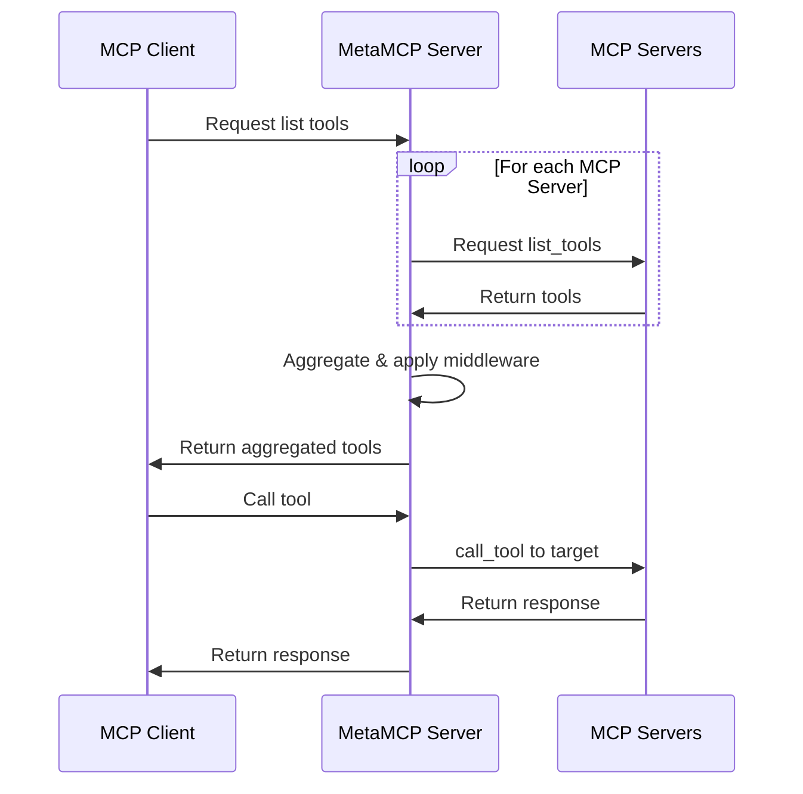

# MetaMCP Architecture

[← Back to Index](index.md)

---

## High-Level Diagram

```
┌─────────────────────────────────────────────────────────────────────┐
│                         MCP Clients                                  │
│         (Claude Desktop, Cursor, Custom Agents)                      │
└─────────────────────────────────────────────────────────────────────┘
                                    │
                    ┌───────────────┼───────────────┐
                    ▼               ▼               ▼
              ┌─────────┐    ┌──────────┐    ┌──────────┐
              │   SSE   │    │Streamable│    │  OpenAPI │
              │Endpoint │    │   HTTP   │    │ Endpoint │
              └─────────┘    └──────────┘    └──────────┘
                    │               │               │
                    └───────────────┼───────────────┘
                                    ▼
┌─────────────────────────────────────────────────────────────────────┐
│                      MetaMCP Server                                  │
│  ┌─────────────┐  ┌─────────────┐  ┌─────────────┐                  │
│  │   Auth      │  │  Middleware │  │   Session   │                  │
│  │   Layer     │  │   Pipeline  │  │   Manager   │                  │
│  └─────────────┘  └─────────────┘  └─────────────┘                  │
│  ┌─────────────────────────────────────────────────┐                │
│  │              MetaMCP Server Pool                 │                │
│  │  ┌─────────┐ ┌─────────┐ ┌─────────┐           │                │
│  │  │Namespace│ │Namespace│ │Namespace│           │                │
│  │  │  Pool   │ │  Pool   │ │  Pool   │           │                │
│  │  └─────────┘ └─────────┘ └─────────┘           │                │
│  └─────────────────────────────────────────────────┘                │
│  ┌─────────────────────────────────────────────────┐                │
│  │              MCP Server Pool                     │                │
│  │  ┌──────┐ ┌──────┐ ┌──────┐ ┌──────┐          │                │
│  │  │Server│ │Server│ │Server│ │Server│          │                │
│  │  │ Idle │ │Active│ │ Idle │ │Active│          │                │
│  │  └──────┘ └──────┘ └──────┘ └──────┘          │                │
│  └─────────────────────────────────────────────────┘                │
└─────────────────────────────────────────────────────────────────────┘
                                    │
                    ┌───────────────┼───────────────┐
                    ▼               ▼               ▼
              ┌─────────┐    ┌──────────┐    ┌──────────┐
              │  STDIO  │    │   SSE    │    │Streamable│
              │ Servers │    │ Servers  │    │  HTTP    │
              └─────────┘    └──────────┘    └──────────┘
```

---

## Tech Stack

| Layer | Technology |
|-------|------------|
| **Frontend** | Next.js |
| **Backend** | Express.js with tRPC |
| **Database** | PostgreSQL with Drizzle ORM |
| **Auth** | Better Auth |
| **Build** | Turborepo monorepo |
| **Deployment** | Docker / Docker Compose |

---

## Service Ports

| Port | Service | Description |
|------|---------|-------------|
| 12008 | Frontend + Proxy | Public-facing unified endpoint |
| 12009 | Backend | Internal Express.js API |
| 5432 (9433 external) | PostgreSQL | Database |

---

## Backend Route Structure

```
/api/auth/*         - Better Auth routes
/metamcp/*          - Public MCP endpoints
/mcp-proxy/*        - Internal MCP proxy routes
/trpc/frontend/*    - tRPC API for frontend
/health             - Health check endpoint
```

---

## Request Flow Sequence



---

## Key Components

### McpServerPool
Manages connections to individual MCP servers with idle session pre-allocation.

### MetaMcpServerPool
Manages namespace-level server instances that aggregate multiple MCP servers.

### Session Manager
Handles session lifecycle, cleanup timers, and expiration.

### Auth Layer
Validates API keys, OAuth tokens, and session cookies.
