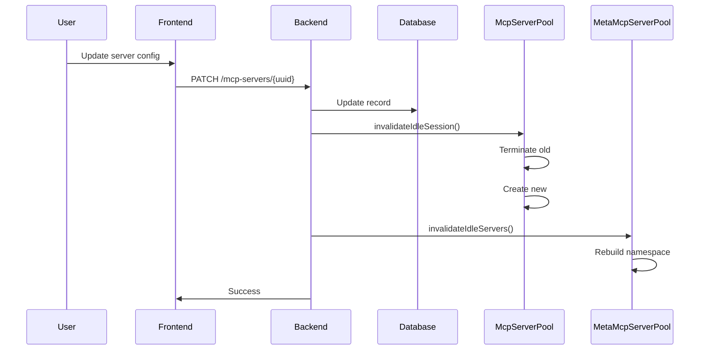

# Performance Optimization

[← Back to Index](index.md)

---

## Cold Start Optimization

MetaMCP pre-allocates idle sessions to reduce connection latency.

```
┌──────────────────────────────────────────────────────┐
│                 MCP Server Pool                       │
│                                                       │
│  Server A: [Idle Session] ← Ready for instant use    │
│  Server B: [Idle Session]                            │
│  Server C: [Idle Session]                            │
│                                                       │
│  When client connects:                               │
│  1. Convert idle → active (instant)                  │
│  2. Create new idle in background (async)            │
└──────────────────────────────────────────────────────┘
```

**Configuration:**
- Default: 1 idle session per server
- Automatic replenishment after use

---

## Session Lifecycle

```
┌─────────┐     ┌─────────┐     ┌─────────┐
│  Idle   │────▶│ Active  │────▶│ Cleanup │
│ Session │     │ Session │     │         │
└─────────┘     └─────────┘     └─────────┘
     ▲               │
     │               │ timeout / disconnect
     │               ▼
     └───── Replenish Idle Pool
```

---

## Invalidation Flow

When server config changes:



---

## Memory Management

| Component | Memory Pattern | Optimization |
|-----------|----------------|--------------|
| Idle Sessions | O(servers) | Limit idle count |
| Active Sessions | O(concurrent users) | Session timeout |
| Tool Cache | O(tools) | Lazy loading |

---

## Recommended Settings

| Scenario | Session Lifetime | Idle Count |
|----------|-----------------|------------|
| Development | 30 min | 1 |
| Production (low traffic) | 1 hour | 1 |
| Production (high traffic) | 15 min | 2-3 |
| Demo/Testing | 5 min | 1 |

---

## Session Cleanup

Automatic cleanup runs every 5 minutes:

1. Checks `session_lifetime` config
2. Finds sessions older than lifetime
3. Cleans up expired sessions
4. Replenishes idle pool

**Set via:** `config.session_lifetime` (milliseconds, or `null` for infinite)

---

## Monitoring

### Pool Status

```bash
curl http://localhost:12008/metamcp/{endpoint}/mcp/health/sessions
```

Response:
```json
{
  "timestamp": "2026-02-02T12:00:00Z",
  "streamableHttpSessions": {
    "count": 5,
    "sessionIds": ["uuid1", "uuid2", ...]
  },
  "metaMcpPoolStatus": {
    "idle": 3,
    "active": 5,
    "activeSessionIds": [...],
    "idleServerUuids": [...]
  },
  "totalActiveSessions": 8
}
```

### Pool Status (Programmatic)

```typescript
const pool = McpServerPool.getInstance();
const status = pool.getPoolStatus();
// { idle: N, active: N, activeSessionIds: [...], idleServerUuids: [...] }
```

---

## Performance Tips

1. **Increase idle sessions** for frequently used servers
2. **Use Streamable HTTP** over SSE for better session management
3. **Set appropriate session lifetime** to balance memory vs cold start
4. **Use custom Dockerfile** to pre-install dependencies
5. **Configure nginx properly** for SSE (disable buffering)
6. **Monitor pool status** to detect resource exhaustion
